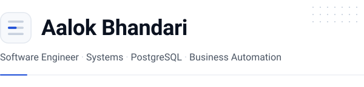
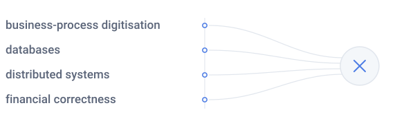
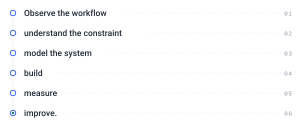

<picture><source media="(prefers-color-scheme: dark)" srcset=".github/assets/hero-dark.svg"></picture>

I build software for **messy real-world business processes**—the kind where correctness, data integrity, concurrency, and reliability matter more than having the newest framework.

My strongest work comes from building systems inside a real travel business, where software is used against actual operational and financial workflows. I currently focus on **PostgreSQL, TypeScript, backend systems, financial data, offline-first workflows, and production engineering**.

I care about one principle:

> **If I claim I built it, the repository should be able to prove it.**

 

## What I Build

<table>
<tr><td><b>Business &amp; financial systems</b> —</td><td>accounting, VAT, reconciliation, billing and compliance workflows</td></tr>
<tr><td><b>Database-driven applications</b> —</td><td>PostgreSQL, multi-tenant architecture, RLS and transactional correctness</td></tr>
<tr><td><b>Offline-first systems</b> —</td><td>synchronization, conflict handling and reliable client/server state</td></tr>
<tr><td><b>Production software</b> —</td><td>testing, observability, CI/CD, backups and failure recovery</td></tr>
<tr><td><b>Automation</b> —</td><td>replacing repetitive operational workflows with reliable software</td></tr>
</table>

 

## Featured Work

<table>
<tr><td>
<h3>🧾 VAT Billing &amp; Accounting System</h3>

A production-oriented billing and accounting platform developed around the operational requirements of a real travel agency.

<b>Focus:</b> 
<code>PostgreSQL</code> · <code>TypeScript</code> · <code>Supabase</code> · <code>Multi-tenancy</code> · <code>RLS</code> · <code>Accounting</code> · <code>VAT</code>

<b>What makes it interesting</b>

<ul>
<li>Multi-tenant database architecture</li>
<li>Database-enforced security</li>
<li>Financial transaction workflows</li>
<li>VAT and billing logic</li>
<li>Real-world business data</li>
<li>Production-oriented reliability and recovery</li>
<li>Designed around an actual operating business rather than a tutorial dataset</li>
</ul>

→ <b><a href="#">View Repository</a></b> 
→ <b><a href="#">Read Case Study</a></b>

</td></tr>
</table>

<table>
<tr><td>
<h3>✈️ Travora</h3>

A travel technology platform designed to modernize the workflow between travelers, travel businesses and digital travel services.

<b>Focus:</b> 
<code>Next.js</code> · <code>TypeScript</code> · <code>PostgreSQL</code> · <code>Supabase</code> · <code>APIs</code> · <code>Travel Technology</code>

<b>Highlights</b>

<ul>
<li>Modern full-stack architecture</li>
<li>Structured travel workflows</li>
<li>Database-backed application state</li>
<li>Service-oriented design</li>
<li>Designed as a foundation for future travel automation</li>
</ul>

→ <b><a href="#">View Repository</a></b> 
→ <b><a href="#">Read Architecture</a></b>

</td></tr>
</table>

<table>
<tr><td>
<h3>🌐 STP Website</h3>

A production web platform focused on performance, maintainability, responsive UX and modern frontend architecture.

<b>Focus:</b> 
<code>Next.js</code> · <code>TypeScript</code> · <code>React</code> · <code>Tailwind CSS</code>

→ <b><a href="#">View Repository</a></b>

</td></tr>
</table>

 

## Currently

I'm deliberately going deeper rather than wider.

### Engineering

<table>
<tr><td>PostgreSQL internals and query performance</td><td>Transactions and concurrency</td></tr>
<tr><td>Distributed systems fundamentals</td><td>Backend architecture</td></tr>
<tr><td>Testing and correctness</td><td>Docker and Linux</td></tr>
<tr><td>CI/CD with GitHub Actions</td><td>AWS infrastructure</td></tr>
<tr><td colspan="2">Observability with logs, metrics and traces</td></tr>
</table>

### Building

I'm working toward turning software built for real business operations into **reusable products for other businesses**.

The current direction is:

<picture><source media="(prefers-color-scheme: dark)" srcset=".github/assets/flow-product-dark.svg"></picture>

### Research

I'm interested in the intersection of:

<picture><source media="(prefers-color-scheme: dark)" srcset=".github/assets/intersect-research-dark.svg"></picture>

 

## Engineering Principles

### 01 — Correctness before complexity

A financial system that looks impressive but produces incorrect numbers is a failure.

I prefer simple systems whose behaviour can be tested, explained and verified.

### 02 — Database-enforced security

Security should not depend entirely on frontend behaviour.

Where appropriate, authorization and isolation belong at the database layer.

### 03 — Production over prototypes

A project becomes interesting when it has to survive:

* bad input
* concurrent operations
* network failures
* partial failures
* data corruption
* deployment mistakes
* real users

### 04 — Measure, don't claim

I try to replace statements such as:

> "This is scalable."

with:

> "Here is the workload, here is the measurement, and here is where it breaks."

### 05 — Fewer technologies, deeper understanding

I'm intentionally reducing the number of technologies I present as expertise.

I'd rather understand a small set of systems deeply than collect an impressive list of logos.

 

## Technical Focus

| Area           | Current Focus                                       |
| -------------- | --------------------------------------------------- |
| Languages      | TypeScript · Java · SQL · Go                        |
| Backend        | Node.js · REST APIs · Backend Architecture          |
| Database       | **PostgreSQL** · Transactions · Indexing · RLS      |
| Frontend       | React · Next.js                                     |
| Infrastructure | Docker · Linux · AWS                                |
| CI/CD          | GitHub Actions                                      |
| Observability  | OpenTelemetry · Structured Logging · Metrics        |
| Testing        | Integration · Concurrency · Property-based Testing  |
| Systems        | Distributed Systems · Synchronization · Reliability |
| Domain         | Travel Technology · Accounting · VAT · Compliance   |

> This list represents technologies I actively work with or am deliberately developing depth in—not every technology I have ever touched.

 

## Open Source

I believe meaningful open-source contribution is more valuable than maintaining an impressive-looking contribution graph.

Over time, I aim to contribute production-quality fixes, features and documentation to projects in the systems I actually use.

**Current areas of interest:**

`PostgreSQL ecosystem`&nbsp; `Supabase ecosystem`&nbsp; `Developer tooling`&nbsp; `Document processing`&nbsp; `Business automation`

 

## Writing

I document things I actually build.

Topics I am particularly interested in:

<table>
<tr><td>Database correctness</td><td>Double-entry accounting systems</td></tr>
<tr><td>Offline-first synchronization</td><td>PostgreSQL concurrency</td></tr>
<tr><td>Production failures</td><td>Business-process automation</td></tr>
<tr><td>Building software inside a real SME</td><td>Engineering trade-offs</td></tr>
</table>

**Writing:** [aalokbhandari.com.np](#)

 

## Education

**B.Sc. Computer Science and Information Technology** 
Madan Bhandari Memorial College · Tribhuvan University

My academic background gives me the fundamentals; real business systems provide the constraints.

 

## Beyond Code

I come from a travel-business environment, so much of my engineering work starts with a problem that existed **before the software did**.

That perspective shapes how I build:

<picture><source media="(prefers-color-scheme: dark)" srcset=".github/assets/flow-method-dark.svg"></picture>

 

## Connect

<table>
<tr>
<td><b>Website:</b> <a href="#">aalokbhandari.com.np</a></td>
<td><b>LinkedIn:</b> <a href="#">Aalok Bhandari</a></td>
<td><b>Email:</b> <a href="mailto:#">Contact me</a></td>
</tr>
</table>

 

<picture><source media="(prefers-color-scheme: dark)" srcset=".github/assets/signature-dark.svg"></picture>

<i>Last updated: August 2026</i>
