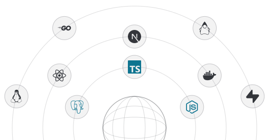

<picture><source media="(prefers-color-scheme: dark)" srcset=".github/assets/hero-dark.svg"></picture>

I build software for **messy real-world business processes**—the kind where correctness, data integrity, concurrency, and reliability matter more than having the newest framework.

My strongest work comes from building systems inside a real travel business, where software is used against actual operational and financial workflows. I currently focus on **PostgreSQL, TypeScript, backend systems, financial data, offline-first workflows, and production engineering**.

> **If I claim I built it, the repository should be able to prove it.**

## What I Build

- **Business & financial systems** — accounting, VAT, reconciliation, billing and compliance workflows
- **Database-driven applications** — PostgreSQL, multi-tenant architecture, RLS and transactional correctness
- **Offline-first systems** — synchronization, conflict handling and reliable client/server state
- **Production software** — testing, observability, CI/CD, backups and failure recovery
- **Automation** — replacing repetitive operational workflows with reliable software

## Stack

<picture><source media="(prefers-color-scheme: dark)" srcset=".github/assets/orbit-dark.svg"></picture>

## Featured Work

### [Kharcha](https://github.com/aalokbhandari/kharcha) &nbsp;·&nbsp; public

Expense management and accounting application — expense tracking, vendor management and inventory control for small businesses.

`TypeScript` · `React` · `Vite` · `Supabase`

The clearest public example of what I mean by business systems: real accounting concepts, database-backed state, and authentication, rather than a CRUD demo.

### VAT Billing & Accounting System &nbsp;·&nbsp; private

A production billing and accounting platform built around the operational requirements of a real travel agency: multi-tenant architecture with database-enforced security, financial transaction workflows, and VAT and billing logic.

`PostgreSQL` · `Supabase` · `Multi-tenancy` · `RLS` · `Accounting` · `VAT`

The repository is private because it holds live client financial data. I'm happy to walk through the schema, the tenancy model and the reconciliation logic.

### Travora &nbsp;·&nbsp; private

A travel technology platform designed to modernize the workflow between travelers, travel businesses and digital travel services — structured travel workflows, database-backed application state, service-oriented design.

`Next.js` · `TypeScript` · `PostgreSQL` · `Supabase`

Private while in development.

### [STP Website](https://github.com/aalokbhandari/STP-website) &nbsp;·&nbsp; public

Multi-page website for Smart Trading Path — premium services, member watchlist, admin chart uploads, and user engagement with likes and comments.

`PHP` · `MySQL` · `JavaScript` · `Google OAuth`

## Currently

I'm deliberately going deeper rather than wider.

**Learning** — PostgreSQL internals and query performance · transactions and concurrency · distributed systems fundamentals · testing and correctness · CI/CD with GitHub Actions · AWS infrastructure · observability with logs, metrics and traces

**Building** — I'm working toward turning software built for real business operations into reusable products for other businesses. The current direction is:

<picture><source media="(prefers-color-scheme: dark)" srcset=".github/assets/flow-product-dark.svg"></picture>

**Research** — I'm interested in the intersection of:

<picture><source media="(prefers-color-scheme: dark)" srcset=".github/assets/intersect-research-dark.svg"></picture>

## Engineering Principles

**01 — Correctness before complexity.** A financial system that looks impressive but produces incorrect numbers is a failure. I prefer simple systems whose behaviour can be tested, explained and verified.

**02 — Database-enforced security.** Security should not depend entirely on frontend behaviour. Where appropriate, authorization and isolation belong at the database layer.

**03 — Production over prototypes.** A project becomes interesting when it has to survive bad input, concurrent operations, network failures, partial failures, data corruption, deployment mistakes, and real users.

**04 — Measure, don't claim.** I try to replace *"this is scalable"* with *"here is the workload, here is the measurement, and here is where it breaks."*

**05 — Fewer technologies, deeper understanding.** I'd rather understand a small set of systems deeply than collect an impressive list of logos.

## Technical Focus

| Area       | Current Focus                                  |
| ---------- | ---------------------------------------------- |
| Database   | **PostgreSQL** · Transactions · Indexing · RLS |
| Languages  | TypeScript · SQL                               |
| Backend    | Node.js · REST APIs · Supabase                 |
| Frontend   | React · Next.js · Tailwind CSS                 |
| Tooling    | Docker · Linux · Git                           |
| Domain     | Accounting · VAT · Travel Technology           |

> Per principle 05, this is only what I would defend in a technical interview today. Things I'm actively learning are listed under **Currently** instead.

## Education

**B.Sc. Computer Science and Information Technology** 
Madan Bhandari Memorial College · Tribhuvan University

My academic background gives me the fundamentals; real business systems provide the constraints.

## Beyond Code

I come from a travel-business environment, so much of my engineering work starts with a problem that existed **before the software did**. That perspective shapes how I build:

<picture><source media="(prefers-color-scheme: dark)" srcset=".github/assets/flow-method-dark.svg"></picture>

## Connect

**Website** aalokbhandari.com.np&nbsp;&nbsp;·&nbsp;&nbsp;**LinkedIn** Aalok Bhandari&nbsp;&nbsp;·&nbsp;&nbsp;**Email** on request

<picture><source media="(prefers-color-scheme: dark)" srcset=".github/assets/signature-dark.svg"></picture>

<i>Last updated: August 2026</i>
