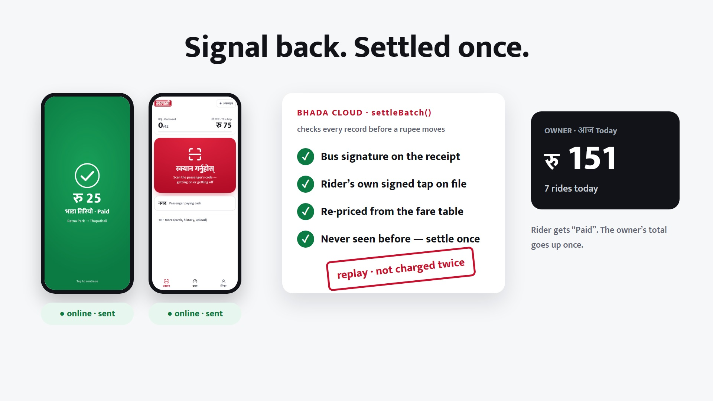
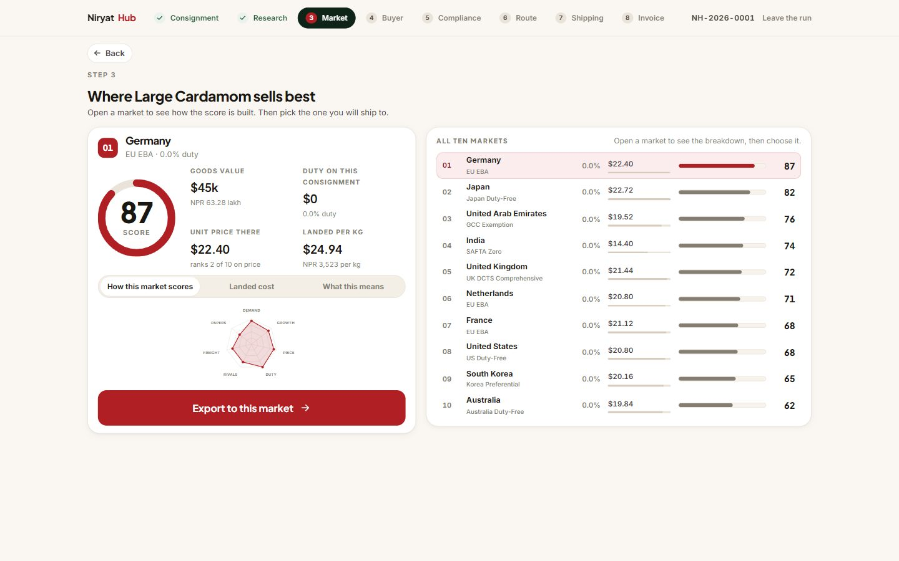
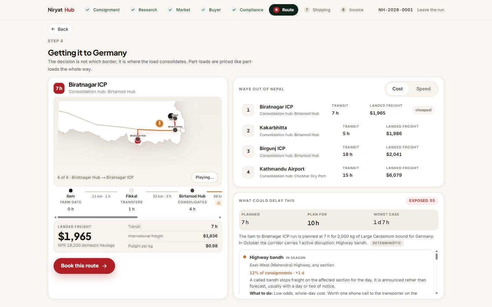

<picture><source media="(prefers-color-scheme: dark)" srcset=".github/assets/hero-dark.svg"></picture>

I build software for **messy real-world business processes**—high-compliance financial ledgers, multi-tenant database isolation, and offline-first sync that survives a dropped connection.

I joined my father's two-person travel agency straight out of high school in 2022. It ran on Excel sheets, paper ledgers and manual ticket tracking, so I used the company as a live testbed while carrying a full B.Sc. CSIT course load. Most of what follows came out of that.

**Latest:** I led Team 4NF to win **MBMC IdeaX 2026** with [Bhada](https://www.aalokbhandari.com.np/projects/bhada), bus fares for Kathmandu that are paid with no signal on the bus. In August the same team took **Best Presentation** at MBMC HackFest 2026 with [NiryatHub](https://www.aalokbhandari.com.np/projects/niryat-hub).

> **If I claim I built it, the repository should be able to prove it.**

## Evidence

Numbers measured on the systems themselves, not estimates. Each one is shown its working on the project page it came from.

| | |
| --- | --- |
| **29,825** | rows of real books migrated — trial balance tied exactly, 0 rows skipped |
| **296** | headless assertions across seven suites, written without a test framework |
| **1** | deployment serving every client, isolated by database row-level security |
| **4** | systems a stranger can open right now, without an account |
| **2** | hackathon awards in 2026: winner of MBMC IdeaX, Best Presentation at MBMC HackFest |

## Featured Work

### [Bhada](https://github.com/MBMC-IdeaX/4NF) &nbsp;·&nbsp; Winner, MBMC IdeaX 2026

**Scan in. Scan out. Fare settled, even in airplane mode.** Kathmandu buses lose signal under every flyover, so Bhada makes the stage fares the buses already charge payable with no internet. The rider shows one signed QR, the conductor scans it getting on and getting off, the fare is priced from the stage table and receipted on the bus, and it settles exactly once on Postgres when either phone finds signal.

Won the 4th national IdeaX hackathon at Madan Bhandari Memorial College: 48 hours, 20 finalist teams from 160 registrations across 28 institutions. I led Team 4NF with Firoz Paudel and Bidhan Thapaliya.

- **Five apps, one backend** — rider, conductor, owner, staff and the public site as installable PWAs on one Supabase project.
- **Twelve Ed25519-signed QR formats** — ride codes, boarding passes, receipts, cash tickets, concession cards, each verified offline where it lands.
- **Money moves once** — PostgreSQL settles a ride only with the rider's own signed tap; a receipt sent twice is a replay. Bhada never holds funds; eSewa does.
- **Proven, not claimed** — five proof scripts gate every deploy, plus 89 unit tests and a 60+ check browser journey that runs one ride through all four network cases.

`React 19` · `Vite` · `PWA` · `Supabase` · `PostgreSQL` · `Edge Functions` · `IndexedDB` · `Ed25519` · `PGlite` · `eSewa` · `Raspberry Pi`

[Live app](https://bhada-one.vercel.app) · [3-minute demo](https://bhada-one.vercel.app/demo) · [Case study](https://www.aalokbhandari.com.np/projects/bhada)

### VAT Billing System &nbsp;·&nbsp; in production, private repository

Double-entry VAT accounting for Nepali ticketing agencies. Every sales invoice is filed with the Inland Revenue Department as it is issued, an issued invoice can never be edited afterwards, and one deployment serves every client — isolated by twelve PostgreSQL row-level-security policies keyed to the tenant ID inside the caller's signed token.

`JavaScript (ES5-compatible)` · `PostgreSQL` · `Supabase (RLS + Edge Functions)` · `PostgREST` · `Deno` · `IndexedDB` · `IRD CBMS e-billing` · `Bikram Sambat`

The framework-free core has no DOM dependencies, so it is testable under Node. The client keeps working with the connection down: IndexedDB holds the working copy plus an outbox, and sync pushes before it pulls, never the other way round. The repository is private because it holds live client financial data — [case study and walkthrough](https://www.aalokbhandari.com.np/projects/vat-billing-system).

### [NiryatHub](https://github.com/aalokbhandari/niryat-hub) &nbsp;·&nbsp; Best Presentation, MBMC HackFest 2026

**Nepal does not have an export-product problem. It has an export-access problem.** NiryatHub takes a Nepali producer from one spoken sentence to a filed commercial invoice — scoring ten destination markets, matching importers, assembling the compliance checklist, costing the corridor out of a landlocked country, and raising the invoice.

<table>
<tr>
<td width="50%"></td>
<td width="50%"></td>
</tr>
</table>

Best Presentation at MBMC HackFest 2026, a 24-hour hackathon with 19 teams, for Team 4NF with Aashika KC, Bidhan Thapaliya and Nilima Mainali.

- **60** product-market pairs, each carrying duty, VAT, freight and demand.
- **58** compliance requirements, every one naming the authority that enforces it.
- **48** costed logistics legs, so a corridor is priced to the buyer, not to the border.
- **62** tests on the scoring weights, route arithmetic and the disruption model.

`Next.js 15` · `React 19` · `TypeScript` · `Web Speech API` · `Vitest`

[Live prototype](https://niryat-hub.vercel.app) · [Case study](https://www.aalokbhandari.com.np/projects/niryat-hub)

### [SipSetu](https://github.com/aalokbhandari/Sipsetu) &nbsp;·&nbsp; public

A bilingual employment identity network for Nepal's returnee migrant workers. Spoken overseas work history becomes a graded Skill Passport, and matching to local jobs is a transparent weighted sum a worker can read line by line rather than a score handed down.

`Next.js 16` · `React 19` · `TypeScript`

### Travora &nbsp;·&nbsp; seventh-semester project

A travel expense app built around how spending on a journey actually happens — in several currencies, from a pile of receipts, against a budget somebody set before leaving. Every trip is a budget, receipts are photographed instead of typed, and each user's data is fenced off by row-level security rather than by a filter in the front end.

`React 19` · `TypeScript` · `PostgreSQL` · `Supabase`

### NSA Travels &nbsp;·&nbsp; flagship, 2022–present

The family travel agency itself: paper ledgers and scattered spreadsheets moved to structured digital records, cloud backup, and a calmer workflow. The accounting workflow, customer and B2B records, and the company website — plus technical support during the move toward IATA accreditation.

## Stack

Eight things, not forty. No skill bars and no long tail of things I touched once — everything below appears in something I have shipped, and most of it in something running right now.

| Group | Tools |
| ----- | ----- |
| **Data and isolation** | PostgreSQL · SQL · Supabase (RLS) · IndexedDB (offline sync) |
| **Runtime and interface** | TypeScript · Node.js · React / Next.js · Git |
| **Domain and data modelling** | Double-entry accounting · Row-level security · Offline-first sync · Multi-tenant data modelling · Database design · REST APIs |
| **Correctness and proof** | Headless testing · Hand-rolled assertion harnesses · Deterministic-first AI boundaries |
| **Learning properly, not claiming yet** | Go · AWS · OpenTelemetry · Docker |

<picture><source media="(prefers-color-scheme: dark)" srcset=".github/assets/orbit-dark.svg"></picture>

## Currently

**Now** — taking Bhada from a winning demo onto a real bus, and hardening the VAT ledger that runs a live business.

**Next** — transport records and hospitality: an in-progress concept for digitizing transport ownership, tax and dealer workflows that are still largely offline in Nepal, and a Nepal-specific hospitality booking platform.

**Learning** — Go · AWS · OpenTelemetry · Docker · PostgreSQL internals and query performance · transactions and concurrency · testing and correctness

**Direction** — turning software built for real business operations into reusable products for other businesses:

<picture><source media="(prefers-color-scheme: dark)" srcset=".github/assets/flow-product-dark.svg"></picture>

**Research** — the intersection of:

<picture><source media="(prefers-color-scheme: dark)" srcset=".github/assets/intersect-research-dark.svg"></picture>

## Engineering Principles

**01 — Correctness before complexity.** A financial system that looks impressive but produces incorrect numbers is a failure. I prefer simple systems whose behaviour can be tested, explained and verified.

**02 — Database-enforced security.** Security should not depend on frontend behaviour. Authorization and isolation belong at the database layer, keyed to something the browser cannot edit.

**03 — Production over prototypes.** A project becomes interesting when it has to survive bad input, concurrent operations, network failures, partial failures, data corruption, deployment mistakes, and real users.

**04 — Measure, don't claim.** I try to replace *"this is scalable"* with *"here is the workload, here is the measurement, and here is where it breaks."*

**05 — Fewer technologies, deeper understanding.** I'd rather understand a small set of systems deeply than collect an impressive list of logos. Things I'm actively learning are listed as learning.

## How I Work

AI is part of how I work now, the way version control and a good editor are. I treat it like a fast, well-read colleague: useful for a first draft, worth arguing with, never the final authority.

Research, first drafts, boilerplate, exploratory code, and the mechanical half of refactoring, testing and documentation are accelerated. Problem definition, architecture, trade-offs, correctness, and full responsibility for everything that ships stay mine. Nothing reaches a system a business depends on without passing my own review — [the full loop, stage by stage](https://www.aalokbhandari.com.np/workflow).

## Education and Training

**B.Sc. Computer Science and Information Technology** · 2022–2027, in progress 
Madan Bhandari Memorial College · Tribhuvan University · aggregate roughly 3.30–3.56 GPA

**Industry training** — Travelport Basic (TMA4) and Advanced Ticketing · Sabre Basic GDS and Red360 Advanced Ticketing · Galileo GDS · VAT and compliance training for travel professionals, NATTA and the Ministry of Finance, Kathmandu

## Beyond Code

I come from a travel-business environment, so much of my engineering work starts with a problem that existed **before the software did**. That perspective shapes how I build:

<picture><source media="(prefers-color-scheme: dark)" srcset=".github/assets/flow-method-dark.svg"></picture>

## Connect

**Website** [aalokbhandari.com.np](https://www.aalokbhandari.com.np)&nbsp;&nbsp;·&nbsp;&nbsp;**LinkedIn** Aalok Bhandari&nbsp;&nbsp;·&nbsp;&nbsp;**Email** aalokbhandari.dev@gmail.com

If you have something that needs building — or something already built that has started to hurt — write to me. I read everything.

<picture><source media="(prefers-color-scheme: dark)" srcset=".github/assets/signature-dark.svg"></picture>

<i>Last updated: October 2026</i>
